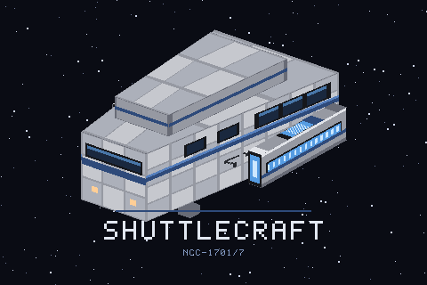

# Shuttlecraft — a Project Zomboid build 42 mod

A Starfleet shuttlecraft for Project Zomboid **42.20.4**, in single player,
hosted co-op and on dedicated servers. Beam up to it from anywhere in
Kentucky, beam back down where you were standing or anywhere on the map, or
call it down onto open ground and walk aboard through the hatch. On a server
the whole crew shares one ship.

Everything is generated at runtime — no TileZed map, no hand-authored art. The
meshes, textures and icons are produced by scripts in `tools/`.



## What it does

| | |
| --- | --- |
| **Beam up** | Right-click anywhere → **Beam up to the shuttle**. No door to walk to and nothing to carry; the pad reaches you whether the ship is parked beside you or overhead. |
| **Beam down** | From the pad, back to the exact spot you left — or set a course first and beam down anywhere on the map. |
| **Call it down** | Right-click a patch of street or field → **Call the shuttle down here**. It needs 3×5 tiles of clear ground and tells you when it hasn't got them. |
| **Travel** | From the helm inside, click the map to lay in a course, then **take her down**. You are beamed to the site first so the ground actually loads, and the ship comes in after you. |
| **Fly it like a truck** | The landed shuttle is a vehicle with four seats. Get in as you would a car, pick a seat on its chart, switch seats, drive. No seat has a door, so nothing can bite you in one. |
| **Take her up** | From the pilot's seat, **Shuttlecraft ▸ Take her up**. She climbs above the rooftops and flies over buildings and trees — and she flies by *driving*, so the throttle, the steering, the seat chart and a controller all work exactly as they do on the ground. Climb, dive, pick a flight speed at the helm, and set her down below. The crew can go aft to the cabin in flight and come back; she waits where you left her. |
| **Never stranded** | If there is not enough room at the destination you are beamed straight back aboard with the reason. A failed landing never leaves you on foot a hundred miles from the ship. |
| **Phasers** | Four in a locker beside the pad. The charge never runs down, they never jam and they never wear out — and they are far quieter than a firearm, which is most of the point. |
| **A hypospray** | One dose puts right bleeding, deep wounds, infected cuts, burns, fractures, pain and stiffness — everywhere on your body at once. It will not touch a bite. Six doses, and the ship replicates more while you are aboard; out in the field, what you are carrying is what you have. |
| **A dermal regenerator** | Run it over the skin and the skin closes: lacerations, scratches, deep wounds and burns, with the stitches and the dressing that were holding them together. No bandage needed, and no charge to run out of. It will not mend a broken bone, touch an infected wound, or close over a piece of glass. |
| **A medical tricorder** | Reads a body the way a surgeon would, whether or not you have ever held a scalpel. On yourself, or — with their say-so — on a crewmate. |
| **A tricorder** | A sensor sweep out to forty tiles, drawn as a contact plot with you at the centre, and a lock override that talks most electronic locks open. Not padlocks, and not inside somebody's safehouse. It reads dilithium too, out to twenty tiles and through the walls of whatever it is shut in. |
| **A replicator** | A machine at the aft end of the galley that makes any item in the game — if the ship holds a pattern for it, and if the reserve covers it. Browse the catalogue by category or search it, pick one, five or ten, and it forms into your hands. |
| **Patterns** | The ship can make what it has scanned. Stand at the replicator and scan what you are carrying: the ship reads it and hands it straight back, and from then on it can make that thing for ever. Starfleet gear — phasers, hyposprays, rations, the blades — it knows from the day it is built. |
| **Dilithium** | The ship's power is a crystal burning in a chamber amidships, and one crystal is a thousand bandages' worth — but nothing refills it for free, and **the replicator cannot make one**. They turn up where a small, valuable, electrical thing would be: a jeweller's case, a pawn shop, an electronics store, a mechanic's shelf. The ship carries three spares, the tricorder finds more, and when the last one is gone the replicator is a cupboard. |
| **Running water** | The galley sink has its own water supply, topped up every in-game minute, so it keeps running after the mains shut off. |
| **A sick bay** | A biobed that is also the ship's bed, an EMH station, and a locker with one of each instrument in it. |
| **Stores** | Three Starfleet lockers — an armoury, the rations and the sick bay — the dilithium chamber, and five containers left empty on purpose: the fridge, the oven, both counters and the microwave are yours to fill. |
| **Shields** | Nothing dead gets within ten tiles of the landed ship. They are shoved back, not killed — no free experience, no free loot. Raise and lower them at the helm. |
| **A shared ship** | In multiplayer there is one shuttle for everyone. Server owners can limit it to its owner and crew. |
| **Bookmarks** | Log any position and set a course back to it later. |
| **No fog at the helm** | The map is fully revealed while the helm is open, so you can aim at somewhere you have never been. Your ordinary map keeps its fog. |

## Installing

From the Steam Workshop, or for development:

```sh
python tools/deploy_windows.py
```

Copies `TrekShuttle/` to `%UserProfile%\Zomboid\mods\TrekShuttle` as
`TrekShuttleDev` (so it cannot clash with a Workshop copy). Enable it in the
Mods screen and in the mod list of the world or server you are playing.

## Running it on a server

The mod is server-authoritative: the ship, the cabin, its stores and the hull
live on the server and every player sees the same ones. Add it to the server's
mods like any other, **and add its map folder in front of the base map**:

```ini
Map=TrekShuttle;Muldraugh, KY
```

The `TrekShuttle` map is a handful of empty cells around the cabin, so the
space outside it is black instead of wilderness with zombies in it. Single
player and the in-game Host settings add it for you; a dedicated server's
`.ini` needs the line above. Without it the shuttle still works, the server
log says `the 'TrekShuttle' map is not loaded`, and the view outside the cabin
shows grass and trees.

Four sandbox options, on the **Shuttlecraft** page:

| Option | Choices | Default |
|---|---|---|
| **Who may use the shuttle** | *Everyone*, or *Owner and crew*: the first player to use it owns it; the owner or an admin adds crew from the aboard menu (**Shuttlecraft ▸ Crew**). Anyone may always beam down or step out. | Everyone |
| **Transporter charges** | *Match anti-cheat*: when `AntiCheatSpeed` is set to kick or ban, each player gets 3 beams with one back every 150 seconds, and a fourth is refused ("recharging") instead of the server kicking them. *Always unlimited*: never refused. | Match anti-cheat |
| **Photon torpedo fire** | *Full*: the torpedo burns, and the fire spreads. *Blast only*: the explosion and the kill without the fire. | Full |
| **Replicator** | *Patterns and energy*: it makes what the ship has scanned, and each one spends from a reserve that only dilithium refills. *Unrestricted*: anything in the catalogue, immediately, for nothing. *Off*: the machine is scenery, and says so. | Patterns and energy |

Every beam moves a character a long way at once, and the speed anti-cheat
counts each one. If your players want unlimited beaming, set
`AntiCheatSpeed=3` (log) or `4` (disabled) in the server's `.ini`, or choose
*Always unlimited* only with one of those.

## Playing

1. Right-click anywhere → **Shuttlecraft ▸ Beam up to the shuttle**. You
   materialise on the transporter pad, aft.
2. Take a **phaser** from the armoury in the starboard row before you go.
3. Right-click aboard for the **Shuttlecraft** menu: the helm, beam down, log
   this position, and — when the ship is on the ground — step out of the hatch.
4. At the **helm**, click the map to lay in a course or pick a logged position,
   then **Take her down**. You are beamed to the site, the ship follows, and
   you end up at the foot of the ramp.
5. On the ground, right-click the hull to **board** it or to **send it back
   up**; right-click open ground to **call it down** somewhere new.

The shuttle is either sitting on the ground somewhere or overhead. The
transporter works either way; the hatch only works when it is down.

Piloting works the way the game does vehicles: the landed shuttle is a vehicle
you get into, with four seats you can switch between. From the pilot's seat the
radial menu takes her up, and she flies over buildings and trees; the helm is
how you cross the map.

The **medical set** lives in the sick-bay locker, third down the starboard row.
Right-click the hypospray, the dermal regenerator or either tricorder in your
inventory to use it; right-click a locked door with a tricorder on you to
override the lock.

The **replicator** stands at the aft end of the galley. Walk up to it and
right-click → **Use the replicator**. The list opens on the game's own
categories: pick one to see what is in it, *Back* to come out, or type in the
search box to look through everything at once. Each category says how many of
its items the ship can actually make, and one button narrows the whole panel
to those. Pick a quantity, press *Materialise*, and it forms into your hands.
**Scan what you carry** teaches the ship everything in your pockets at once —
it costs nothing and you keep the lot.

The reserve across the top is what a replication spends, and **nothing refills
it for free**. It is a dilithium crystal burning in the chamber amidships —
the cabinet at the port side of the second row — and when it is spent the ship
loads a spare from that same chamber by itself. One crystal is about a
thousand bandages or two hundred hammers, so this is not a thing to ration; it
is a thing to go and find, once in a long while, with the tricorder. The ship
starts with three, and the replicator cannot make a fourth.

## How much room it needs

The hull is three tiles across and five long, and it will not set down unless
all fifteen squares are clear floor with nothing solid, no vehicle and nobody
standing on them. The square *you* are standing on does not count against it —
you step aside as it comes in.

When it refuses it says why, and the reasons are worth reading:

- *"Not enough room to land. The shuttle needs 15 clear squares and 6 of them
  are blocked."* — the usual one. Try a street, a car park or a field.
- *"there is a vehicle in the way"* — move the car, or land elsewhere.
- *"part of that ground is not solid"* — you are aiming at a hole, water, or
  the edge of a floor.

## Layout

The cabin is one compartment on one storey, generated in cell 96,40 — clear of
the vanilla map (which ends at cell x 77), of the Fifth-Wheel RV interior at
cell 85,40, and of the TARDIS mod's decks at 92,40 if you have that installed
too.

Four squares across by six fore and aft: twenty-four squares against a hull
that is fifteen, so the inside and the outside tell the same story.

```
    0123
  0 TVTA      T monitor wall   V television   A armoury
  1 F*.p      F fridge   * lamp   p rations
  2 oh.M      o oven   h crew seat   M sick bay
  3 wD.E      w sink counter   D dilithium   E EMH panel
  4 m*.B      m microwave counter   B biobed (head)
  5 R.@B      R the replicator   @ transporter pad   B biobed (foot)
```

Run `python tests/test_layout.py` to print this from the source, so it can
never drift out of date with the code.

## Repository layout

```
TrekShuttle/42/media/lua/shared/TREK/   config, helpers, protocol, ship state,
                                        world queries, interior layout
TrekShuttle/42/media/lua/server/TREK/   the authority: cabin build, stock, water,
                                        hull, commands, transporter charges
TrekShuttle/42/media/lua/client/TREK/   transporter, arrival, helm, menus,
                                        shields, phaser, the medical set
TrekShuttle/42/media/sandbox-options.txt  server-owner settings
TrekShuttle/42/media/models_X/          shuttle and helm meshes (.x)
TrekShuttle/42/media/textures/          generated textures and icons
TrekShuttle/42/media/scripts/           item and model definitions
tools/                                  asset generators and dev scripts
tests/                                  static checks and the multiplayer simulation
```

`MULTIPLAYER.md` is the design: who owns what, the command protocol, and the
engine facts it rests on.

## Tools

| | |
| --- | --- |
| `tools/pzapi.py` | Prints real Java method signatures out of the game jar. The game ships no `javap`, and guessing at engine method names is the most expensive mistake available here. |
| `tools/pzcatalog.py` | Builds and queries catalogues of every build 42 sprite and item id. |
| `tools/preview_model.py` | Software renderer for `.x` meshes — check a model without launching the game. Auto-fits the frame, so a five-tile hull is as viewable as a one-tile box. |
| `tools/gen_shuttle.py` | Hull texture, mesh and inventory icon. |
| `tools/gen_helm.py` | The helm console prop, no longer placed in the cabin. |
| `tools/gen_phaser.py` | Phaser inventory icon. |
| `tools/gen_medical.py` | The hypospray, tricorder and regenerator sounds. (Their icons come from the Gemini toolkit; the originals are in `design/art/medical/`.) |
| `tools/gen_replicator.py` | The replicator — mesh, texture and materialisation sound — and the two renders it was judged on, into `design/art/replicator/`. |
| `tools/gen_dilithium.py` | The dilithium crystal's inventory icon, into `design/art/dilithium/`. |
| `tools/gen_poster.py` | The mods-screen poster. |
| `tools/luacheck.py` | Parses every Lua file through a real Lua VM. |
| `tools/deploy_windows.py` | Copy the mod into the Zomboid mods folder as `TrekShuttleDev` and verify the copy. |
| `tools/package_workshop.py` | Stage the Workshop upload (keeps the published item id). |
| `tools/readtest.sh` | Pull the mod's own lines out of `console.txt`. |

## Testing

Static checks, seconds each, no game required:

```sh
python tools/luacheck.py TrekShuttle/42/media/lua   # every Lua file parses
python tests/test_assets.py                         # sprites, items, models,
                                                    # icons and translation keys
python tests/test_stock.py                          # loot spreads and fills
python tests/test_layout.py                         # floor plan, fittings, footprint
python tests/test_helm.py                           # the helm console and the
                                                    # tricorder plot draw and work
python tests/test_multiplayer.py                    # single player and a server with
                                                    # two clients, simulated
```

`test_multiplayer.py` is the one worth knowing about: it loads every Lua file
into separate runtimes -- one for single player, then a server and two clients
joined by a fake network that carries only plain data -- and plays the mod:
beaming, the cabin build reaching every client, ownership and crew, transporter
charges, landing, ghosts, shields, the torpedoes, the medical set and the
replicator. It fails if a client ever edits the world or the ship itself.

In game, load a **fresh** world with the mod enabled. From the debug console
(the reports go to the server's log, `console.txt` in single player):

| | |
| --- | --- |
| `TREK_Stock()` | One line per container: items held and how full. |
| `TREK_Water()` | Top up the water fixtures and log each one's reading. |
| `TREK_Galley()` | One of each galley dish into your inventory. |
| `TREK_Rebuild()` | Tear the cabin down and regenerate it, fully restocked. Stand aboard first. |
| `TREK_Beam()` | Beam up if you are outside, down if you are aboard. |
| `TREK_Room()` | Report whether the ship could land where you stand, and what is in the way. |
| `TREK_Phaser()` | Report how many phasers the sweep can see on you and recharge them. |
| `TREK_Ghosts()` | Sweep hulls still waiting to be cleared, and any near you. |
| `TREK_Charges()` | Report whether beams are rationed and your charges. |
| `TREK_Replicator()` | Report the sandbox mode, the reserve, how many spare crystals are in the chamber, how many patterns the ship holds, and how big the catalogue came out. |

The design and diagnostic ones need single player or an admin on a server.

## Changing it

- **[DESIGN.md](DESIGN.md)** — how the ship is laid out: furnishing the cabin,
  the footprint, picking sprites and items, regenerating the models, and the
  engine constraints the whole design is shaped around.
- **[DEV_GUIDE.md](DEV_GUIDE.md)** — how to work on it: the build loop, the
  rules that exist because they were broken, failure signatures and what they
  actually mean, and how to test.

Almost every change is an edit to `TREK_Config.lua`, or the BuildingEd
interior plus `TREK_InteriorLayout.lua`.

## Known limits

- **One shuttle per world.** In multiplayer the crew shares it; a second
  ship is not supported.
- **Flight has been flown in single player, not in multiplayer.** The shuttle
  flies on an invisible floor the mod lays at altitude, because a vehicle's
  height in build 42 is decided by whether there is a floor under it and not by
  its physics. A one-square rim of that floor may be visible under the hull.
  See `PILOTING.md`.
- **She flies between levels 1 and 4**, which clears a two-storey building. The
  ceiling is deliberate: there is nothing above it to fly over.
- **The hull does not block anything.** It is a world model, and world models
  have no collision: zombies and players walk through it. The footprint is
  enforced when it lands, not afterwards.
- **The hull always faces the same way.** World inventory items cannot be
  rotated, so the bow always points north.
- **The phaser chambers 9mm on paper.** AmmoTypes are registered in Java and a
  mod cannot declare one, so the item names a real vanilla type to be sure it
  fires. Since the charge is restored far faster than it can be spent, none of
  your own ammunition is ever touched — but reloading it by hand would use it.
- **The phaser looks like a pistol in your hands**, because it borrows a
  vanilla in-hand model; the inventory icon is the mod's own. That was once
  written here as a limitation — "in-hand weapon models need a rigged
  attachment set" — and it is simply not true: a weapon model is a plain
  static mesh, which is how the four blades have their own. Rebuilding a
  pistol shape the game already has has just never been worth it.
- **Changing a loot list does not restock a cabin that already exists.** The
  ship is meant to be lived in, so a rebuild never refills a container. Use
  `TREK_Rebuild()`, or a fresh world.
- **Beaming down needs somewhere to stand.** It searches six tiles around the
  target and gives up rather than putting you inside a wall.
- **Nothing in the medical set cures a bite**, and the medical tricorder does
  not tell you whether you are infected. Both are deliberate: the cure is the
  Emergency Medical Hologram's, and the EMH is not built yet.
- **The dermal regenerator will not close a wound with glass or a bullet in
  it**, and will not take the dressing off a bitten limb. It says so both
  times.
- **The tricorder will not open a padlock**, or any lock inside a safehouse
  you are not a member of. Somebody fitted those by hand.
- **The medical set reaches new worlds only.** Like every other change to what
  the ship carries, it is stocked when the cabin is built and an existing save
  keeps the lockers it already has.
- **The replicator only makes what the ship has scanned.** Patterns belong to
  the ship, not to a player, so a crew shares them — and the ship starts
  knowing its own Starfleet gear and nothing else. Scanning is free and never
  consumes the item.
- **Nothing refills the reserve for free.** It is one dilithium crystal, and
  the only way to get another is to find one. Sleeping does nothing, waiting
  does nothing, and the replicator cannot make them — which is the point of
  the whole arrangement.
- **Crystals reach new worlds only.** Both the three in the ship's chamber and
  the ones out in the town are placed when a world is made, so an existing
  save will not have them.
- **The catalogue is every item in your game**, including other mods'. That is
  the point of reading it out of the engine rather than writing a recipe list,
  and it means a name or an icon the shuttle has never heard of can appear in
  it. Vehicle-furniture placeholders, hidden items and obsolete ones are
  filtered out; the torpedo warhead and the hull are blocked by name.
- **What it makes goes into your hands**, not into a tray: the machine owns
  its square and borrows nothing. You are charged for what actually arrived,
  which matters when an item turns out not to be makeable at all.
