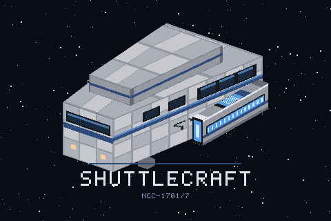

# Shuttlecraft — a Project Zomboid build 42 mod

A Starfleet shuttlecraft for Project Zomboid **42.20.4**, in single player,
hosted co-op and on dedicated servers. Beam up to it from anywhere in
Kentucky, beam back down where you were standing or anywhere on the map, or
call it down onto open ground and walk aboard through the hatch. On a server
the whole crew shares one ship.

Everything is generated at runtime — no TileZed map, no hand-authored art. The
meshes, textures and icons are produced by scripts in `tools/`.



## What it does

| | |
| --- | --- |
| **Beam up** | Right-click anywhere → **Beam up to the shuttle**. No door to walk to and nothing to carry; the pad reaches you whether the ship is parked beside you or overhead. |
| **Beam down** | From the pad, back to the exact spot you left — or set a course first and beam down anywhere on the map. |
| **Call it down** | Right-click a patch of street or field → **Call the shuttle down here**. It needs 3×5 tiles of clear ground and tells you when it hasn't got them. |
| **Travel** | From the helm inside, click the map to lay in a course, then **take her down**. You are beamed to the site first so the ground actually loads, and the ship comes in after you. |
| **Fly it like a truck** | The landed shuttle is a vehicle with four seats. Get in as you would a car, pick a seat on its chart, switch seats, drive. No seat has a door, so nothing can bite you in one. |
| **Take her up** | From the pilot's seat, **Shuttlecraft ▸ Take her up**. She rises smoothly to her hover height -- five storeys by default, set on the sandbox page -- and hovers, and she flies by *driving*, so the throttle, the steering, the seat chart and a controller all work exactly as they do on the ground. Her shadow on the street below marks exactly where she will come down. Pick a flight speed at the helm, and **Set her down below** when you are there. Up or down and nothing in between: there is one flight height, and anything taller than it is a wall she slows to a stop in front of. The crew can go aft to the cabin in flight and come back; she waits where you left her. While she is up the hatch is shut, so the transporter is the way off her — and once the last of you has beamed down she goes back up, ready to be called down again. |
| **Never stranded** | If there is not enough room at the destination you are beamed straight back aboard with the reason. A failed landing never leaves you on foot a hundred miles from the ship. |
| **Phasers** | Four in the armoury, with their own model. The charge never runs down, they never jam and they never wear out, and they are far quieter than a firearm, which is most of the point. Every shot is a visible orange bolt. They holster -- in vanilla's holsters or the Starfleet one. Right-click a tree to **cut it down** or a door to **cut through it** in a few seconds, with a beam everybody nearby sees and hears. A beam defeats any lock, padlocks included, because the door stops being there. Somebody else's safehouse door is refused, and the sandbox can limit cutting to trees or switch it off. |
| **A hypospray** | One dose puts right bleeding, deep wounds, infected cuts, burns, fractures, pain and stiffness — everywhere on your body at once. It will not touch a bite. Six doses, and the ship replicates more while you are aboard; out in the field, what you are carrying is what you have. |
| **A dermal regenerator** | Run it over the skin and the skin closes: lacerations, scratches, deep wounds and burns, with the stitches and the dressing that were holding them together. No bandage needed, and no charge to run out of. It will not mend a broken bone, touch an infected wound, or close over a piece of glass. |
| **A medical tricorder** | Reads a body the way a surgeon would, whether or not you have ever held a scalpel. On yourself, or — with their say-so — on a crewmate. |
| **A tricorder** | A sensor sweep out to forty tiles, drawn as a contact plot with you at the centre, It reads dilithium too, out to twenty tiles and through the walls of whatever it is shut in — and **from a seat in the shuttle it reads the ground below you**, which is how you pick a town worth landing at. |
| **Distress calls** | Once the ship is commissioned, she starts hearing them: a chime and a note -- *a Starfleet ensign is down, 320 tiles NE*. Answer at the sensor console, aboard. Declining or ignoring one costs nothing, and another comes later. |
| **The downed ensign** | Accept and the clock starts: three game days. A mark goes on the map, the tricorder finds them within forty tiles as a blue cross, and they are sitting on the ground, doubled over, in uniform, their combadge chirping -- and drawing in the dead from the surrounding block. Right-click to **Examine** them, or to **Beam them to safety** from within three tiles: the replicator learns three new patterns and you are handed a small supply. Too late, and the signal stops. |
| **PADDs** | A Starfleet tablet that holds digital copies of books, with no limit. Carry one to a school or a library, right-click a book (or a whole shelf's worth selected in the loot panel) and **Load onto PADD** -- the book stays where it was. Right-click the PADD to **read** any of them, as often as you like, **five times faster** than paper, with the same skill multipliers, recipes and comfort. Copy a library to another PADD; lose the PADD and you lose the books, recover it and they come back. Two in the armoury; the replicator makes blank ones. |
| **The PADD's screen** | **Open PADD** from its menu (a controller: select it, press A) or press **K** (rebindable under Options -> Mods). Three views on the shoulder buttons: the **channel**, its **history**, and the **library**. Any VHS tape can be **transcribed** onto a PADD and read there: reading it does what watching it does, once -- the boredom, the stress, a training tape's XP. |
| **The Adirondack** | Lt. Shepard, in orbit, calls your PADD a week after the shuttle is commissioned (sandbox: *When the Adirondack first calls*). Answer wherever you are. One player holds the channel, the rest read along; silence is an answer; a missed call comes back worse. Fifteen threads tell what happened here and who made the county -- including six holo fragments a probe can find, which she puts on tape for the shelf. Tell her to stop calling and she does. |
| **A replicator** | A machine at the aft end of the galley that makes any item in the game — if the ship holds a pattern for it, and if the reserve covers it. Browse the catalogue by category or search it, pick one, five or ten, and it forms into your hands. |
| **Patterns** | The ship can make what it has scanned. Stand at the replicator and scan what you are carrying: the ship reads it and hands it straight back, and from then on it can make that thing for ever. Starfleet gear — phasers, hyposprays, rations, the blades — it knows from the day it is built. |
| **Dilithium** | The ship's power is a crystal burning in the warp core amidships, and nothing refills it for free: **the replicator cannot make one**. They lie on the county's wild ground -- fields, woods, dirt, never in town -- and turn up now and then where a small, valuable, electrical thing would be: a jeweller's case, a pawn shop, an electronics store. The tricorder finds them, probes point at them, and when the last one is gone the ship is dark. |
| **Everything runs on it** | Beaming, calling her down, taking off, flying, hovering, the shields, the Doctor, probes and the galley all draw on the crystal, and a gauge on screen shows what is left. At zero she goes **dark**: red emergency light, no replicator, no Doctor, no beaming -- and if she was in the air she comes down, undamaged, as soon as there is room. Load a crystal and she comes back with a very pleasant sound. |
| **Cold start** | A new world (by default) starts with the shuttle **landed near you, dark**, with two probes and no spare crystals. Walk aboard, launch a probe, walk to the dilithium it finds, bring it back and load it -- and she is commissioned. |
| **The warp core** | Amidships, in the port passage. Right-click it to load a crystal you have found, or to take one back before a trip. It says how many the ship is holding on the option itself, so you never have to guess. |
| **Running water** | The galley sink has its own water supply, topped up every in-game minute, so it keeps running after the mains shut off. |
| **The Doctor** | The sick bay's wall station projects an Emergency Medical Hologram. He diagnoses, he treats -- everything a hypospray and a regenerator do between them, plus the glass and the bullets neither will touch -- and his supplies never run out. He also tells you the one thing the medical tricorder will not: whether you are infected. |
| **The only cure for a bite** | He is it. Nothing else in the mod touches a zombie bite. It costs **one whole dilithium crystal and twelve game hours aboard**, the crystal goes the moment the treatment starts, and walking out of the cabin halfway through loses it. Sleep it off on the biobed. |
| **A sick bay** | A biobed that is also the ship's bed, the EMH's station, and a locker with one of each instrument in it. |
| **Uniforms** | Six Starfleet garments, in command red, operations gold and sciences teal: a one-piece duty uniform and a long formal dress uniform, both with a combadge at the left breast. Male and female. They keep the cold off and they are not armour. The armoury carries one of each, and the replicator knows all six from the day the ship is built. |
| **Species** | Pick one on the traits page: Vulcan, Klingon, Andorian, Betazoid, Trill, Bajoran, Talaxian, Orion, an android or a liberated Borg -- or none, and be human. Each has its own strengths, its own price and its own look: pointed ears, a ridged brow, blue skin and antennae, spots, an implant. The look is worn in the world and seen by everybody on the server. |
| **A taste of home** | Every species has its dishes in the galley. Its own cooking cheers it up; somebody else's does not; a Vulcan will not enjoy meat, and a Klingon knows replicated food when they taste it. |
| **Starfleet professions** | Seven: command, the helm, engineering, security, medical, science and cultural survey. Each reports for duty with its skills, its kit -- a phaser, a hypospray, a tricorder, a PADD -- and its division's uniform on the creation screen. An engineer makes the dilithium go further; a flight controller gets more out of the shuttle. |
| **Rank** | Every rescue counts. The first earns a field commission from the *Adirondack*, whatever you told Shepard you were, and the rest take you up to commander. |
| **Traits** | Transporter phobia, turbolift phobia, spacesickness, real food only, Starfleet Academy, and a holo-historian's way with a PADD. |
| **Contraband** | The crew's hideouts off the Adirondack's Jefferies tubes hold what the first officer would confiscate: ketracel-white, felicium, Trellium-D, Saurian brandy, kanar, latinum, a holosuite reel -- and a Ktarian game, which feels wonderful, a little less wonderful every round, and gets passed from hand to hand. Three of the drugs and the Game are habits: withdrawal is miserable, it passes on its own, and the Doctor will detox you. A PADD's flashing light breaks the Game. |
| **The U.S.S. Adirondack** | Beam across to the ship in orbit from the shuttle's aboard menu and walk her five decks: the bridge, the lounge and the crew's quarters, the transporter room and sickbay (her Doctor is always up), main engineering with her own warp core, and hydroponics. Turbolifts between the decks, doors that open as you come, beds and chairs you can use, and replicators of her own. |
| **The armoury** | Off her bridge: lockers of phasers, phaser rifles and Starfleet holsters, and a trophy case of everybody else's -- a Klingon disruptor and disruptor rifle, a Romulan disruptor, a Jem'Hadar polaron rifle and a Cardassian phaser, each with its own model, sound and colour of bolt, and each kept charged the way a phaser is. Pistols holster and rifles sling; only Starfleet's cut trees and doors. The hideouts hide more of the alien arms. |
| **Her crew** | Starfleet officers and crew of several species step out of the lifts, walk to their posts, sit, talk to each other and to you, and leave again. They know who you are not, and they notice your clothes. |
| **Hydroponics** | Deck 5 grows seven crops in trays the ship tends for you -- tea, bergamot, Klingon coffee, plomeek, leola root, Andorian tuber, hasperat peppers -- to be dried, ground, brewed and cooked into the galley's dishes from scratch. A tank of serpent worms breeds when fed; five of them in a bowl is gagh. |
| **Jefferies tubes** | Crawlways between her decks, across the stars under her, for anybody who would rather not take the lift. Three hideouts off them where the off-watch crew keep their bottles -- and their contraband, and other people's weapons. |
| **The field station** | Muldraugh's electronics store, on the main road beside the Zippee, has a breaker box on its stockroom wall that is not a breaker box. Open it, and the lift behind it takes you down to a Starfleet survey station on one long floor -- living quarters along one side of its corridor; operations and its wall of screens watching the county, a galley with its own replicator, an armoury, an infirmary, a reactor and stores along the other -- staffed by some of the eleven who stayed on the ground, and running on its own dilithium. The Adirondack's crew talk about it; the station has not answered them since June. |
| **Building aboard** | Build what you like in the shuttle's cabin, on the Adirondack and in the field station, and pick up and move the mod's own furniture as you would vanilla's. Nothing you build or move is undone by the ship; only the machines (replicators, warp cores, the Doctor's stations, the lift panels) stay put. |
| **Stores** | Three Starfleet lockers — an armoury, the rations and the sick bay — and five containers left empty on purpose: the fridge, the oven, both counters and the microwave are yours to fill. |
| **Shields** | Nothing dead gets within ten tiles of the landed ship. They are shoved back, not killed — no free experience, no free loot. Raise and lower them at the helm. |
| **A shared ship** | In multiplayer there is one shuttle for everyone. Server owners can limit it to its owner and crew. |
| **Bookmarks** | Log any position and set a course back to it later. |
| **No fog at the helm** | The map is fully revealed while the helm is open, so you can aim at somewhere you have never been. Your ordinary map keeps its fog. |

## Installing

From the Steam Workshop, or for development:

```sh
python tools/deploy_windows.py
```

Copies `TrekShuttle/` to `%UserProfile%\Zomboid\mods\TrekShuttle` as
`TrekShuttleDev` (so it cannot clash with a Workshop copy). Enable it in the
Mods screen and in the mod list of the world or server you are playing.

## Running it on a server

The mod is server-authoritative: the ship, the cabin, its stores and the hull
live on the server and every player sees the same ones. Add it to the server's
mods like any other, **and add its map folder in front of the base map**:

```ini
Map=TrekShuttle;Muldraugh, KY
```

The `TrekShuttle` map is a handful of empty cells around the cabin, so the
space outside it is black instead of wilderness with zombies in it. Single
player and the in-game Host settings add it for you; a dedicated server's
`.ini` needs the line above. Without it the shuttle still works, the server
log says `the 'TrekShuttle' map is not loaded`, and the view outside the cabin
shows grass and trees.

Eleven sandbox options, on the **Shuttlecraft** page:

| Option | Choices | Default |
|---|---|---|
| **Who may use the shuttle** | *Everyone*, or *Owner and crew*: the first player to use it owns it; the owner or an admin adds crew from the aboard menu (**Shuttlecraft ▸ Crew**). Anyone may always beam down or step out. | Everyone |
| **Transporter charges** | *Match anti-cheat*: when `AntiCheatSpeed` is set to kick or ban, each player gets 3 beams with one back every 150 seconds, and a fourth is refused ("recharging") instead of the server kicking them. *Always unlimited*: never refused. | Match anti-cheat |
| **Photon torpedo fire** | *Full*: the torpedo burns, and the fire spreads. *Blast only*: the explosion and the kill without the fire. | Full |
| **Replicator** | *Patterns and energy*: it makes what the ship has scanned, and each one spends from a reserve that only dilithium refills. *Unrestricted*: anything in the catalogue, immediately, for nothing. *Off*: the machine is scenery, and says so. | Patterns and energy |
| **Emergency Medical Hologram** | *Full*: the Doctor as designed, cure included. *Off*: the sick bay's station is inactive and says so. There is deliberately no setting that keeps him and removes the cure -- a server owner who does not want the cure turns him off. | Full |
| **Hover height** | *2, 3, 4, 5, 6 or 8 storeys*: how high she hovers in flight. Buildings with fewer storeys pass beneath her; anything taller is a wall she slows to a stop in front of. Raise it for Louisville's towers. | 5 storeys |
| **How the shuttle starts** | *Cold start*: landed near the first player, dark, no spares, two probes. *Commissioned*: overhead, with a full crystal and three spares. Only a brand new world is affected. | Cold start |
| **Dilithium in the wild** | *Plentiful*, *Scarce* or *None*: crystals lying on natural ground out in the county. | Plentiful |
| **When the Adirondack first calls** | *Straight away*, *after a day*, *three days*, *a week* or *two weeks* after commissioning. | After a week |
| **Phaser cutting** | *Trees and doors*, *Trees only* or *Off*. Somebody else's safehouse is refused either way. | Trees and doors |
| **Hydroponics tend themselves** | *Yes*: the Adirondack's trays are watered and kept free of pests. *No*: they need tending like any crop. | Yes |

Every beam moves a character a long way at once, and the speed anti-cheat
counts each one. If your players want unlimited beaming, set
`AntiCheatSpeed=3` (log) or `4` (disabled) in the server's `.ini`, or choose
*Always unlimited* only with one of those.

## Playing

1. **On a cold start** (the default), the shuttle is landed near you and has
   no power: walk to her and in through the hatch, launch a probe from the
   sensor console, and bring back the crystal it finds. Once she is
   commissioned, everything below works.
2. Right-click anywhere → **Shuttlecraft ▸ Beam up to the shuttle**. You
   materialise on the transporter pad, aft.
3. Take a **phaser** from the armoury, forward on the starboard side, before
   you go.
4. Right-click aboard for the **Shuttlecraft** menu: the helm, the sensor
   console, beam down, beam to the *Adirondack*, log this position, and --
   when the ship is on the ground -- step out of the hatch.
5. At the **helm**, click the map to lay in a course or pick a logged position,
   then **Take her down**. You are beamed to the site, the ship follows, and
   you end up at the foot of the ramp.
6. On the ground, right-click the hull to **board** it or to **send it back
   up**; right-click open ground to **call it down** somewhere new.

The **field station** is under the electronics store in Muldraugh. Go in
through the shop, through to the stockroom, and right-click the grey breaker
box on the west wall: **Open the breaker box**, then **Lift: down to the field
station**. Down there the lift car's menu has **Up to the stockroom**; there
is no transporter below.

The shuttle is either sitting on the ground somewhere or overhead. The
transporter works either way; the hatch only works when it is down.

Piloting works the way the game does vehicles: the landed shuttle is a vehicle
you get into, with four seats you can switch between. From the pilot's seat the
radial menu takes her up and sets her down -- one hovering height, nothing in
between -- and she clears everything shorter than it. Her shadow on the ground
is where she will land. While
she is up the hatch is shut, so the transporter is the way off her, and once
the last of the crew has beamed down she goes back up and waits to be called.
The helm is how you cross the map.

The **medical set** lives in the sick-bay locker, third down the starboard row.
Right-click the hypospray, the dermal regenerator or either tricorder in your
inventory to use it; right-click a locked door with a tricorder on you to
override the lock.

The **replicator** stands at the aft end of the galley. Walk up to it and
right-click → **Use the replicator**. The list opens on the game's own
categories: pick one to see what is in it, *Back* to come out, or type in the
search box to look through everything at once. Each category says how many of
its items the ship can actually make, and one button narrows the whole panel
to those. Pick a quantity, press *Materialise*, and it forms into your hands.
**Scan what you carry** teaches the ship everything in your pockets at once —
it costs nothing and you keep the lot.

The reserve across the top is what a replication spends, and **nothing refills
it for free**. It is a dilithium crystal burning in the warp core — the lit
blue column standing in the port passage — and when it is spent the ship loads
a spare by itself. One crystal is about a thousand bandages or two hundred
hammers, so this is not a thing to ration; it is a thing to go and find, once
in a long while, with the tricorder. The ship starts with three, the
replicator cannot make a fourth, and you put the ones you find in by
right-clicking the core.

## How much room it needs

The hull is three tiles across and five long, and it will not set down unless
all fifteen squares are clear floor with nothing solid, no vehicle and nobody
standing on them. The square *you* are standing on does not count against it —
you step aside as it comes in.

When it refuses it says why, and the reasons are worth reading:

- *"Not enough room to land. The shuttle needs 15 clear squares and 6 of them
  are blocked."* — the usual one. Try a street, a car park or a field.
- *"there is a vehicle in the way"* — move the car, or land elsewhere.
- *"part of that ground is not solid"* — you are aiming at a hole, water, or
  the edge of a floor.

## Layout

The cabin is one compartment on one storey, generated in cell 96,40 — clear of
the vanilla map (which ends at cell x 77), of the Fifth-Wheel RV interior at
cell 85,40, and of the TARDIS mod's decks at 92,40 if you have that installed
too.

Four squares across by six fore and aft: twenty-four squares against a hull
that is fifteen, so the inside and the outside tell the same story.

```
    0123
  0 TVLA      T monitor wall   V television   L tape shelf   A armoury
  1 F*.p      F fridge   * lamp   p rations
  2 oh.M      o oven   h crew seat   M sick bay
  3 wD.H      w sink counter   D warp core   H the EMH and his station
  4 m*.B      m microwave counter   B biobed (head)
  5 R.@B      R the replicator   @ transporter pad   B biobed (foot)
```

Run `python tests/test_layout.py` to print this from the source, so it can
never drift out of date with the code.

## Repository layout

```
TrekShuttle/42/media/lua/shared/TREK/   config, helpers, protocol, ship state,
                                        world queries, interior layout
TrekShuttle/42/media/lua/server/TREK/   the authority: cabin build, stock, water,
                                        hull, commands, transporter charges
TrekShuttle/42/media/lua/client/TREK/   transporter, arrival, helm, menus,
                                        shields, phaser, the medical set
TrekShuttle/42/media/sandbox-options.txt  server-owner settings
TrekShuttle/42/media/models_X/          shuttle and helm meshes (.x)
TrekShuttle/42/media/textures/          generated textures and icons
TrekShuttle/42/media/scripts/           item and model definitions
TrekShuttle/common/media/maps/          the void map: space round both ships
content/                                every tape and every channel call, as written
design/                                 BuildingEd interiors, crew talk, source art
tools/                                  asset generators and dev scripts
tests/                                  static checks and the multiplayer simulation
```

`MULTIPLAYER.md` is the design: who owns what, the command protocol, and the
engine facts it rests on.

## Tools

| | |
| --- | --- |
| `tools/pzapi.py` | Prints real Java method signatures out of the game jar. The game ships no `javap`, and guessing at engine method names is the most expensive mistake available here. |
| `tools/pzcatalog.py` | Builds and queries catalogues of every build 42 sprite and item id. |
| `tools/preview_model.py` | Software renderer for `.x` meshes — check a model without launching the game. Auto-fits the frame, so a five-tile hull is as viewable as a one-tile box. |
| `tools/gen_shuttle.py` | Hull texture, mesh and inventory icon. |
| `tools/gen_helm.py` | The helm console prop, no longer placed in the cabin. |
| `tools/gen_phaser.py` | The phaser: mesh, icon, review sheet and its four sounds (from the bake `tools/bake_phaser.py` makes). |
| `tools/gen_phaser_beam.py` | The phaser's beam strip and spark, and their review sheet. |
| `tools/gen_medical.py` | The hypospray, tricorder and regenerator sounds. (Their icons come from the Gemini toolkit; the originals are in `design/art/medical/`.) |
| `tools/gen_replicator.py` | The replicator — mesh, texture and materialisation sound — and the two renders it was judged on, into `design/art/replicator/`. |
| `tools/gen_dilithium.py` | The dilithium crystal's inventory icon, into `design/art/dilithium/`. |
| `tools/gen_warpcore.py` | The warp core — mesh and texture — and the two renders it was judged on, into `design/art/warpcore/`. |
| `tools/gen_ensign.py` | The downed ensign: the vanilla body and our uniform, posed in the game's own animation and baked into six static figures, with the render they were judged on in `design/art/ensign/`. |
| `tools/xskin.py` | Reads the game's skinned `.x` characters and animations, and poses one at a given frame -- what `gen_ensign.py` is built on. |
| `tools/gen_comms.py` | The Adirondack channel: writes the dialogue tree and `Print_Text.json` from `content/comms/`, and refuses a tree with an orphan goto, an unreachable node, a timed node with no silence, or a flag nothing sets. |
| `tools/gen_fragment.py` | The six holo fragments: one mesh and texture, six numbered icons, and their sheet in `design/art/fragment/`. |
| `tools/gen_padd.py` | The PADD: mesh, LCARS texture, icon rendered from the mesh, and its sheet in `design/art/padd/`. |
| `tools/gen_poster.py` | The mods-screen poster. |
| `tools/fieldstation_site.py` | Reads the vanilla map's rooms and tiles round the field station's hidden entrance and prints the stockroom square by square, with the server's own rule for where the breaker box may hang. |
| `tools/gen_fuse_box.py` | The field station's breaker box, drawn: the picture the furniture sheet lays on a wall. |
| `tools/luacheck.py` | Parses every Lua file through a real Lua VM. |
| `tools/deploy_windows.py` | Copy the mod into the Zomboid mods folder as `TrekShuttleDev` and verify the copy. |
| `tools/package_workshop.py` | Stage the Workshop upload (keeps the published item id). |
| `tools/readtest.sh` | Pull the mod's own lines out of `console.txt`. |

## Testing

Static checks, seconds each, no game required:

```sh
python tools/luacheck.py TrekShuttle/42/media/lua   # every Lua file parses
python tests/test_assets.py                         # sprites, items, models,
                                                    # icons and translation keys
python tests/test_stock.py                          # loot spreads and fills
python tests/test_layout.py                         # floor plan, fittings, footprint
python tests/test_helm.py                           # the helm console and the
                                                    # tricorder plot draw and work
python tests/test_multiplayer.py                    # single player and a server with
                                                    # two clients, simulated
python tests/test_comms.py                          # the channel's dialogue tree
python tests/test_crew.py                           # the crew's talk
python tests/test_farming.py                        # recipes, crops and sinks
```

`test_multiplayer.py` is the one worth knowing about: it loads every Lua file
into separate runtimes -- one for single player, then a server and two clients
joined by a fake network that carries only plain data -- and plays the mod:
beaming, the cabin build reaching every client, ownership and crew, transporter
charges, landing, ghosts, shields, the torpedoes, the medical set, the
replicator, distress calls and rescues, the PADD's timed actions crossing to
the server by name, the energy system and the cold start, traits, the
Adirondack and her crew, the field station, hydroponics, the tubes and contraband. It fails if a client ever edits the world or the ship itself.

In game, load a **fresh** world with the mod enabled. From the debug console
(the reports go to the server's log, `console.txt` in single player):

| | |
| --- | --- |
| `TREK_Stock()` | One line per container: items held and how full. |
| `TREK_Water()` | Top up the water fixtures and log each one's reading. |
| `TREK_Galley()` | One of each galley dish into your inventory. |
| `TREK_Rebuild()` | Tear the cabin down and regenerate it, fully restocked. Stand aboard first. |
| `TREK_Beam()` | Beam up if you are outside, down if you are aboard. |
| `TREK_Room()` | Report whether the ship could land where you stand, and what is in the way. |
| `TREK_Phaser()` | Report how many phasers the sweep can see on you and recharge them. |
| `TREK_Ghosts()` | Sweep hulls still waiting to be cleared, and any near you. |
| `TREK_Charges()` | Report whether beams are rationed and your charges. |
| `TREK_Replicator()` | Report the sandbox mode, the reserve, how many spare crystals the ship is holding, how many patterns it holds, and how big the catalogue came out. |
| `TREK_Power()` | Top up the ship's devices and log each one's cell. |
| `TREK_Uniform()` | Whether each uniform's garment resolved, and the model and texture it came back with. |
| `TREK_EMH()` | Report the sandbox mode, the reserve and the spares, what the Doctor costs, any cure that is running -- and whether he is actually standing on the deck, as against what the ship believes. |

The design and diagnostic ones need single player or an admin on a server.

## Changing it

- **[DESIGN.md](DESIGN.md)** — how the ship is laid out: furnishing the cabin,
  the footprint, picking sprites and items, regenerating the models, and the
  engine constraints the whole design is shaped around.
- **[DEV_GUIDE.md](DEV_GUIDE.md)** — how to work on it: the build loop, the
  rules that exist because they were broken, failure signatures and what they
  actually mean, and how to test.

Almost every change is an edit to `TREK_Config.lua`, or the BuildingEd
interior plus `TREK_InteriorLayout.lua`.

## Known limits

- **One shuttle per world.** In multiplayer the crew shares it; a second
  ship is not supported.
- **Flight has been flown in single player at five storeys, and with two
  people at level 1.**
  The shuttle flies on an invisible floor the mod lays at altitude, because a
  vehicle's height in build 42 is decided by whether there is a floor under it
  and not by its physics. A one-square rim of that floor may be visible under
  the hull. See `PILOTING.md`.
- **There is one flight height, and she hovers at it.** No climbing, no diving:
  she is on the ground or she is up. The height is the sandbox's **Hover
  height**, five storeys by default; a building that tall or taller is a wall,
  and she slows to a crawl in front of it rather than hitting it. If the
  engine will not hold her at a height she comes back down by herself and says
  so, and a lower setting is the answer.
- **Her shadow is round and moves a square at a time.** It is drawn with the
  game's own ground markers, which take one texture and whole-square positions.
- **The hull does not block anything.** It is a world model, and world models
  have no collision: zombies and players walk through it. The footprint is
  enforced when it lands, not afterwards.
- **The hull always faces the same way.** World inventory items cannot be
  rotated, so the bow always points north.
- **The phaser chambers 9mm on paper.** AmmoTypes are registered in Java and a
  mod cannot declare one, so the item names a real vanilla type to be sure it
  fires. Since the charge is restored far faster than it can be spent, none of
  your own ammunition is ever touched — but reloading it by hand would use it.
- **The phaser doesn't fit a holster yet.** It has no `AttachmentType`, so it
  goes in a hand or a bag. One line would make it fit every vanilla holster
  (`PHASERS.md`).
- **Changing a loot list does not restock a cabin that already exists.** The
  ship is meant to be lived in, so a rebuild never refills a container. Use
  `TREK_Rebuild()`, or a fresh world.
- **Beaming down needs somewhere to stand.** It searches six tiles around the
  target and gives up rather than putting you inside a wall.
- **The downed ensign does not move.** The game can only animate a
  character, and the only characters a mod can put in the world are either
  not networked or zombies. So the ensign is the game's own body in the mod's
  uniform, baked in one frame of the game's own pain animation. The chirp,
  the tricorder and the countdown are what say they are alive. `ENSIGN.md`
  section 3 has the whole answer.
- **Zombies do not kill the ensign; the clock does.** The beacon draws the
  dead already in the neighbourhood toward them, and they stand between you
  and the rescue -- but the figure is not a character, so nothing can attack
  it.
- **Nothing in the medical set cures a bite**, and the medical tricorder does
  not tell you whether you are infected. Both are deliberate: the cure is the
  Emergency Medical Hologram's, and so is the diagnosis. Walk aft to the sick
  bay and ask him.
- **The Doctor needs power, and the cure needs a crystal.** He draws on the
  same dilithium the replicator does, so a ship with nothing left in the warp
  core has a galley fixture and a hologram that will not switch on. The cure
  costs a whole crystal on top of that.
- **A cure is a commitment.** The crystal is spent when it starts, not when it
  finishes, and leaving the ship before the twelve hours are up loses both.
- **The dermal regenerator will not close a wound with glass or a bullet in
  it**, and will not take the dressing off a bitten limb. It says so both
  times.
- **The tricorder will not open a padlock**, or any lock inside a safehouse
  you are not a member of. Somebody fitted those by hand.
- **The medical set reaches new worlds only.** Like every other change to what
  the ship carries, it is stocked when the cabin is built and an existing save
  keeps the lockers it already has.
- **The replicator only makes what the ship has scanned.** Patterns belong to
  the ship, not to a player, so a crew shares them — and the ship starts
  knowing its own Starfleet gear and nothing else. Scanning is free and never
  consumes the item.
- **Nothing refills the reserve for free.** It is one dilithium crystal, and
  the only way to get another is to find one. Sleeping does nothing, waiting
  does nothing, and the replicator cannot make them — which is the point of
  the whole arrangement.
- **Crystals in the town reach new worlds only**, because loot is rolled when
  a world is made. Crystals in wild ground are placed as a player first loads
  that ground, so they reach an existing save wherever it has not been
  explored yet.
- **The cold start only applies to a brand new world.** A save made before it
  carries on commissioned.
- **The warp core is not a cupboard.** It holds crystals and nothing else, and
  you put them in and take them out from its right-click menu rather than by
  opening it.
- **The catalogue is every item in your game**, including other mods'. That is
  the point of reading it out of the engine rather than writing a recipe list,
  and it means a name or an icon the shuttle has never heard of can appear in
  it. Vehicle-furniture placeholders, hidden items and obsolete ones are
  filtered out; the torpedo warhead and the hull are blocked by name.
- **What it makes goes into your hands**, not into a tray: the machine owns
  its square and borrows nothing. You are charged for what actually arrived,
  which matters when an item turns out not to be makeable at all.
